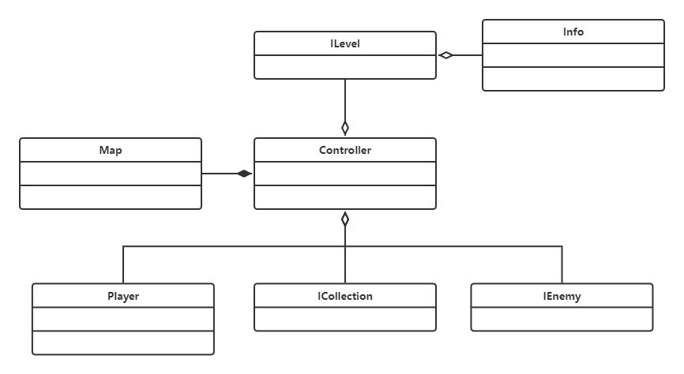

# 诡异森林

#### 介绍
原生C++生存迷宫类小游戏

你误入于幽暗的森林之中，凭借有限的火光，尽量逃离黑暗吧！但是要注意，迷雾中可能潜藏着未知的危险......

#### 软件架构

- 控制类：用于实现UI功能，以及游戏核心逻辑控制

- 关卡类：实现关卡的配置

- 地图类：实现地图的显示，以及游戏数据信息的存储

- 敌人类：实现敌人相关的逻辑，同时为不同种类的敌人提供扩展

- 道具类：实现道具相关的逻辑，同时为不同种类的道具提供扩展

- 玩家类：实现玩家相关的逻辑

#### 具体规则说明

1. 游戏为回合制，玩家每回合可以向上、下、左、右移动；玩家需要找寻出口，若找到出口则当前关卡胜利

2. 玩家的视野受限，只能显示以玩家为中心的一部分区域

3. 玩家的移动步数受限，当玩家移动完所有步数后，说明玩家的火把已经燃尽，当前关卡失败

4. 每个关卡都藏有若干敌人，敌人也可以在每回合内移动，敌人可对玩家造成伤害

5. 玩家可在探索过程中获取地图中散落的道具，不同道具可为玩家带来不同的效果

#### 参与贡献

***itmWuma***

https://gitee.com/itmwuma